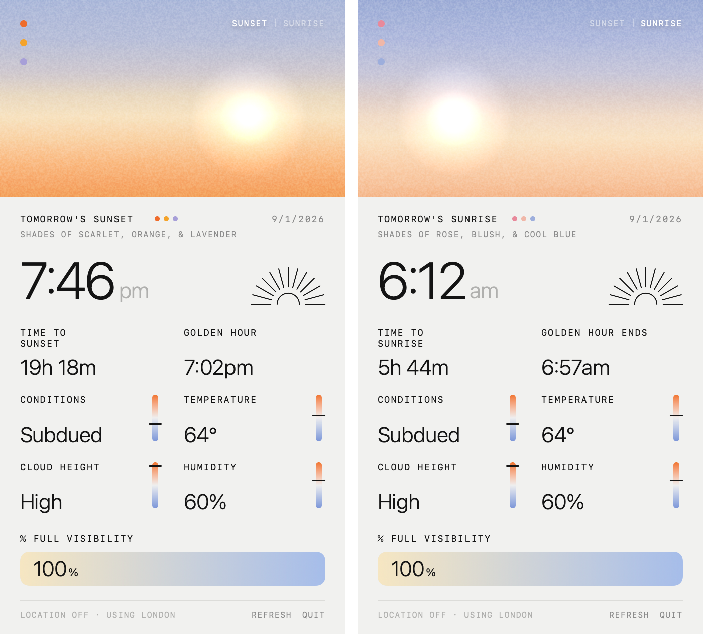
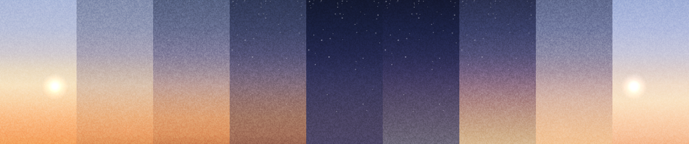

# Sunset Tracker

A macOS menu bar app that tells you when the sun sets, and whether it's going to
be worth looking at. Recreated from a mobile app concept, adapted to the menu bar.



## Install

```bash
./build.sh
open "build/Sunset Tracker.app"
```

Requires macOS 14+. The first launch asks for location access — grant it, or
decline and it falls back to a city derived from your system timezone and names
which one in the footer.

To start it automatically: System Settings → General → Login Items → add
`build/Sunset Tracker.app`.

## Sunset ⇄ Sunrise

The toggle in the top right switches which event the panel describes. Rather than
cutting between them, the sky takes the long way round — dusk, night, dawn — so
the switch reads as time passing. The numbers swap at the darkest point.



## Where the numbers come from

Four kinds of number, with four different levels of trust. Worth keeping
straight, because they are *not* equally reliable.

### Solar times — computed locally, and verified

Sunrise, sunset and golden hour are computed on your machine in
[`Solar.swift`](Sources/SolarKit/Solar.swift) using the NOAA Solar Calculator
formulation (Meeus, *Astronomical Algorithms*). No API, no key, works offline.

Verified against two independent references — `astral`, a separate Python
implementation, and the **US Naval Observatory**, which is authoritative:

```bash
Tests/run.sh
```

Over 10 cities from 0.2°S to 64°N, sampled across a year:

| | median | p95 | max |
|---|---|---|---|
| **this implementation** | 13s | 28s | **33s** |
| `astral`, same events | 17s | 50s | 76s |

USNO publishes only to the minute, so much of that residual is their reporting
resolution rather than error.

### Weather — a forecast model, not an observation

Temperature, humidity, cloud cover by level and visibility come from
[Open-Meteo](https://open-meteo.com) (free, no API key). This is a *model blend*,
not a reading from an instrument near you. It is usually good and occasionally
wrong, and it cannot be verified the way the astronomy can.

Visibility in particular is a model diagnostic rather than a measured quantity,
and Open-Meteo publishes it hourly rather than as a current value.

### The quality score — a heuristic, i.e. an opinion

The `Vivid` / `Subdued` label and the 0–1 score behind it are
[my formula](Sources/SunsetBar/Weather.swift), not a published index. It encodes
what sunset chasers look for:

- **mid- and high-level cloud is the canvas** — it catches light from below the
  horizon after the sun is gone. High cloud is weighted above mid, and ~55%
  cover is treated as the sweet spot.
- **low cloud is the enemy** — it blocks the light before it reaches that canvas,
  so it scales the score down hard.
- **humidity above 55% and poor visibility** mute the colour.

There is no ground truth to check this against. A "Spectacular" that turns out
grey is the heuristic being wrong, not a bug.

### Location

CoreLocation when granted; otherwise a city derived from your system timezone
([`FallbackLocation.swift`](Sources/SunsetBar/FallbackLocation.swift)). A
hardcoded default is wrong for most people and wrong *quietly* — the panel would
show one city's sunset formatted in another city's timezone.

## Where the colours come from

Short answer: **me, not the data.** Worth being explicit, because the panel
prints things like `SHADES OF SCARLET, ORANGE, & LAVENDER` and that reads like a
prediction. It isn't.

- The **sunset gradient** is nine hex stops in [`Theme.swift`](Sources/SunsetBar/Theme.swift),
  transcribed by eye from the original mockup.
- The **dusk, night, dawn and sunrise gradients** are hand-authored to sit either
  side of it. Sunrise is deliberately cooler and rosier than sunset — an
  aesthetic choice, not a measurement.
- The **palette names** and the **three dots** are fixed tables in
  [`Weather.swift`](Sources/SunsetBar/Weather.swift), five entries each per mode,
  selected by which band the quality score falls into.

The forecast's only influence on colour is *saturation*: a low score desaturates
the sky toward grey and picks a duller name from the table. Nothing samples real
sky data, and no part of this predicts the actual hue of tonight's sky. Doing
that properly would mean modelling scattering against solar elevation and
aerosol content — a much bigger job, and a genuinely interesting one.

## How it's built

Everything in the panel is drawn, not bitmapped: the sunburst is a `Shape`, the
gauges and meter are gradient-filled capsules, and the sky is a five-keyframe
gradient with generated, tiled film grain in `.overlay` blend mode.

| | |
|---|---|
| `SolarKit/Solar.swift` | Sun position and event times |
| `SunsetBar/Theme.swift` | Colours, type scale, sky keyframes, grain |
| `SunsetBar/Components.swift` | Sunburst, gauge, meter, stat cell, sky, stars |
| `SunsetBar/SunsetPanel.swift` | Panel layout and the mode toggle |
| `SunsetBar/SunsetModel.swift` | State, refresh timers, formatting |
| `SolarCheck/main.swift` | CSV dump consumed by the verification harness |

Two details that are load-bearing and easy to regress:

- `SkyView` conforms to `Animatable`. Without it SwiftUI re-renders straight at
  the destination phase, and the sky cross-fades sunset→sunrise, **skipping night
  entirely** — every keyframe correct, none of them seen.
- Stat labels reserve two lines (`lineLimit(2, reservesSpace: true)`). This aligns
  values across columns as in the original, and stops rows moving when a label
  changes length between modes.

## Development

`SUNSETBAR_SNAPSHOT=<path>` renders the panel offscreen once live data arrives —
both modes, plus a filmstrip of the transition — then exits. The filmstrip frames
are produced by driving `animatableData`, the same way SwiftUI does mid-animation,
so it exercises the animation path rather than just the keyframes.

```bash
SUNSETBAR_SNAPSHOT=/tmp/out.png "build/Sunset Tracker.app/Contents/MacOS/SunsetBar"
```

The rendered modes are pixel-comparable, which is how the layout-shift fix above
is verified: every text row lands on the same y in both.
